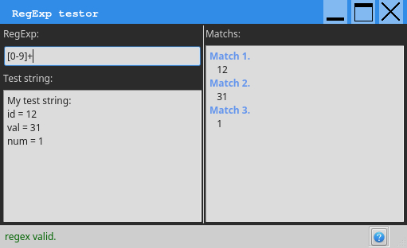

# RegExpTestor
A regular expression testor like the rubular website  
With Qt5.x, The window should have the same look on all OS  

## Requirement
bash for the postinst script

## Install
1. Download the package on the [release page](https://github.com/thibDev/RegExpTestor/releases).
2. Move into the folder `package`
3. Use the package manager or write in the shell>  
`sudo dpkg -i regexp_testor.deb` or `sudo gdebi regexp_testor.deb`

That's all

## Thanks to
Olivier Boucard for his custom window tutorial
https://qt.developpez.com/tutoriels/braindeadbzh/customwindow/
